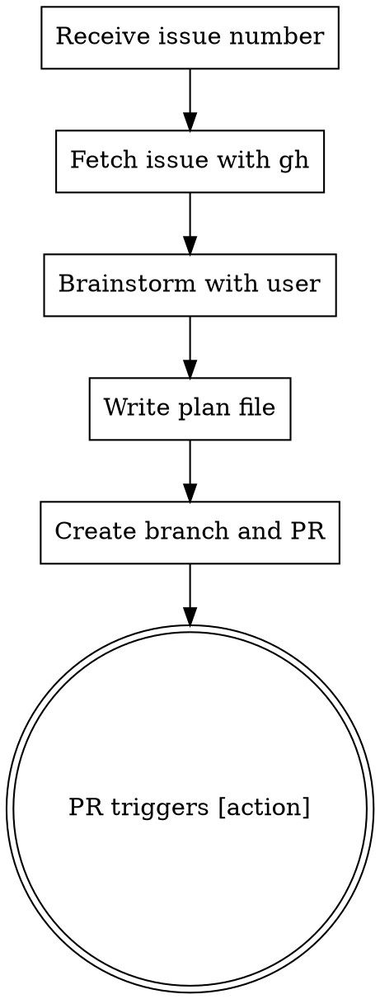

# Issue to PR

Convert a GitHub issue into an actionable PR with a plan that auto-triggers Claude execution.

## Usage

```
/issue-to-pr <issue-number-or-url>
```

## Workflow



## Steps

### 1. Parse Input

Extract issue number from argument:
- `123` → issue #123
- `https://github.com/owner/repo/issues/123` → issue #123
- `owner/repo#123` → issue #123 in owner/repo

### 2. Fetch Issue

```bash
gh issue view <number> --json title,body,labels,assignees
```

Present issue summary to user.

### 3. Brainstorm Solutions

**REQUIRED:** Invoke `superpowers:brainstorming` skill with the issue context (if superpowers plugin is available). Otherwise, conduct a manual brainstorming discussion with the user.

This ensures:
- User intent is clarified
- Multiple approaches are explored
- Requirements are understood before planning

Do NOT skip brainstorming. Do NOT write a plan without user discussion.

### 4. Write Plan

After brainstorming concludes, write plan to `docs/plans/issue-<number>-<slug>.md`:

```markdown
# <Title from brainstorming>

Issue: #<number>

## Context
<Brief problem statement>

## Approach
<Chosen approach from brainstorming>

## Tasks
1. <Specific implementation task>
2. <Another task>
...

## Acceptance Criteria
- <Criteria from issue/brainstorming>
```

### 5. Create PR

```bash
# Create branch
git checkout -b issue-<number>-<slug>

# Stage only the plan file
git add docs/plans/issue-<number>-<slug>.md

# Commit
git commit -m "Add plan for #<number>: <title>"

# Push
git push -u origin issue-<number>-<slug>

# Create PR with [action] at the BEGINNING
gh pr create --title "Fix #<number>: <title>" --body "[action]

## Summary
<Brief description from brainstorming>

Closes #<number>"
```

**CRITICAL:** The PR body MUST start with `[action]` on the first line. This triggers automated plan execution.

## Example

```
User: /issue-to-pr 42

Claude: Let me fetch issue #42...

[Fetches issue: "Add dark mode support"]

I'll use superpowers:brainstorming to explore this with you.

[Invokes brainstorming - discusses approaches, user preferences, scope]

Based on our discussion, I'll create the plan...

[Writes docs/plans/issue-42-dark-mode.md]
[Creates branch, commits, pushes]
[Creates PR with body starting with "[action]"]

Created PR #45: Fix #42: Add dark mode support
The [action] trigger will automatically execute the plan.
```

## Common Mistakes

| Mistake | Fix |
|---------|-----|
| Skipping brainstorming | Always use superpowers:brainstorming (or manual discussion) first |
| `[action]` not at start | PR body must BEGIN with `[action]` |
| Including code in PR | Only commit the plan file |
| Generic plan | Use specifics from brainstorming |
